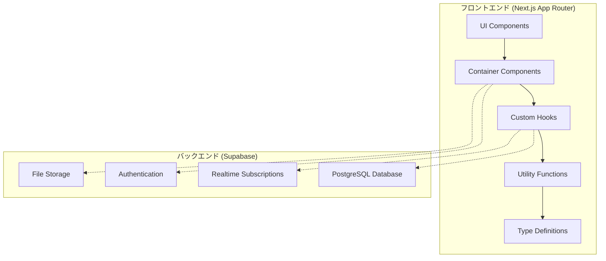

# システムパターン

このドキュメントでは、プロジェクトのアーキテクチャとシステムパターンを定義します。現在は設計段階であり、詳細は開発の進行に伴って確定していきます。

## システムアーキテクチャ (計画段階)

このプロジェクトでは、Next.js 14 の App Router を使用したフロントエンドと Supabase をバックエンドとするアーキテクチャを採用する予定です。



## 主要コンポーネント (計画段階)

1. **フロントエンド**

   - **UI Components**: プレゼンテーションロジックを担当
   - **Container Components**: ビジネスロジックとデータフェッチングを担当
   - **Custom Hooks**: Supabase との通信やロジックのカプセル化
   - **Utility Functions**: 共通機能の提供
   - **Type Definitions**: 型定義によるタイプセーフな開発

2. **バックエンド (Supabase)**
   - **Authentication**: ユーザー認証と権限管理
   - **PostgreSQL Database**: メッセージやユーザー情報の永続化
   - **Storage**: ファイルアップロード機能
   - **Realtime Subscriptions**: リアルタイムデータ同期

## 技術的決定 (検討中)

1. **Container/Presentation パターン**

   - UI ロジックとビジネスロジックの分離
   - 再利用可能なプレゼンテーションコンポーネント
   - コンテナコンポーネントによるデータ管理

2. **テスト駆動開発 (TDD)**

   - テストファーストアプローチ
   - Jest + React Testing Library を使用
   - コンポーネントレベルとフック単位のテスト
   - インテグレーションテストの重視

3. **サーバーコンポーネントとクライアントコンポーネントの適切な使い分け**

   - 静的コンテンツにはサーバーコンポーネント
   - インタラクティブな要素にはクライアントコンポーネント
   - 適切なコード分割と SSR の最大活用

4. **型安全性の重視**
   - TypeScript による厳格な型チェック
   - zod によるランタイムバリデーション
   - データレイヤーから UI レイヤーまで一貫した型定義

## 設計パターン (検討中)

1. **アダプターパターン**

   - Supabase との連携を抽象化したアダプター
   - テスト容易性のための依存性の抽象化
   - 将来的なバックエンド変更に対する柔軟性

2. **カスタムフックパターン**

   - ロジックの再利用と分離
   - `useAuth`, `useChat`, `useMessages`などの具体的なフック
   - データフェッチングと状態管理の統一的なアプローチ

3. **共通レイアウトコンポーネントパターン**

   - アプリケーション全体でのデザインの一貫性を確保するための共通コンポーネント
   - **PageHeader**: ページのタイトル、サブタイトル、アクションボタン、ブレッドクラムを一貫した方法で表示
   - **SectionHeader**: ページ内のセクションのタイトルとアクションを統一されたスタイルで表示

4. **StoryDriven 開発フロー**

   - Storybook を中心とした開発アプローチ
   - デザインシステムの視覚的構築と検証
   - コンポーネントの単体テストとしての Story
   - デザイン全体像の確認と試行錯誤による方針決定

5. **コンポーネント配置ルール**

   アプリケーションでコンポーネントを作成する際は、以下のルールに従って配置する計画です：

   - **ページに依存しない汎用コンポーネント**:

     - 配置場所: `src/app/_components/`
     - 例: ボタン、入力フィールド、カード、モーダル、データ表示用コンポーネントなど

   - **ページに依存する独自コンポーネント**:
     - 配置場所: `src/app/(app)/[page_name]/_components/`
     - 例: 特定のページでのみ使用されるカスタムセクション、特殊なデータ表示など

## ディレクトリ構成 (計画段階)

プロジェクトは以下の構造に従って整理する予定です：

```
app
├── <Segment> (例: dashboard, messages, settings など)
│  ├── page.tsx           # ページコンポーネント
│  ├── layout.tsx         # セグメント特有のレイアウト
│  ├── _components/       # Segment特有のコンポーネント
│  ├── _containers/
│  │  ├── <Container Name>  # 機能別のコンテナ
│  │  │  ├── index.tsx      # エクスポート用インデックス
│  │  │  ├── container.tsx  # ビジネスロジックとデータフェッチング
│  │  │  ├── presentational.tsx # UIのみのプレゼンテーション
│  │  │  └── ...
│  │  └── ...
│  ├── _lib/             # Segment特有の汎用関数など
│  └── ...
├── _components/         # アプリケーション全体で使用する汎用コンポーネント
├── _lib/                # アプリケーション全体で使用する汎用関数
└── ...
```

この構成には以下の特徴があります：

- **関心の分離**: UI（プレゼンテーション）とロジック（コンテナ）が明確に分離
- **セグメント単位の整理**: 機能ごとにセグメント化され、関連するファイルが同じディレクトリに集約
- **コンテナ/プレゼンテーションの明示的な分離**: 各機能のコンテナとプレゼンテーションが明確に分離
- **スケーラビリティ**: 新機能の追加が容易なモジュラー構造
- **アクセス可能性**: 命名規則が一貫しており、ファイルの検索が容易

## アーキテクチャの制約 (検討中)

1. **パフォーマンス要件**

   - 初期読み込み時間: 2 秒以内
   - メッセージ送信からの表示時間: 200ms 以内
   - バンドルサイズの最適化: 初期ロードは 250KB 以下

2. **スケーラビリティ要件**

   - 同時接続ユーザー: 最大 1000 ユーザー
   - 1 日のメッセージ数: 最大 10 万メッセージ
   - ストレージ容量: 初期 10GB、拡張可能

3. **セキュリティ要件**

   - 認証情報の適切な管理
   - HTTPS 通信の強制
   - CSRF や XSS 対策の実装
   - 適切な権限管理の仕組み

4. **アクセシビリティ要件**
   - WCAG 2.1 AA レベルへの準拠
   - キーボードナビゲーションのサポート
   - スクリーンリーダー対応
   - 色のコントラスト比の確保

## 実装ステップ

1. **初期設計と技術選定** (現在のフェーズ)

   - アーキテクチャの計画
   - 技術スタックの確定
   - 設計パターンの決定

2. **基本構造の実装**

   - プロジェクトの初期化
   - ディレクトリ構造の作成
   - 基本的なルーティングの設定

3. **コアコンポーネントの実装**

   - 共通 UI コンポーネントの開発
   - 状態管理の基盤構築
   - Supabase との連携レイヤーの開発

4. **機能別実装**
   - 認証機能の実装
   - チャット機能の実装
   - ユーザープロフィール機能の実装
   - 通知機能の実装

## 次のステップ

- Next.js プロジェクトの初期セットアップ
- Supabase プロジェクトの作成と初期設定
- 基本的なディレクトリ構造の実装
- 認証機能の基盤構築
